# Jailhouse Rock.

Jailhouse Rock is a site used to advertise a rock concert held within an abandoned prison located in Portsmouth, Kingston. The site will target those who love rock music, including classic rock, rock and roll modern-day rock, and emo rock. Jailhouse Rock will host the best bands spread out over 4 days. The site will also tell people the location and have a selection of images of previous bands throughout the years and a form that will give them the chance to win **Free** merchandise.

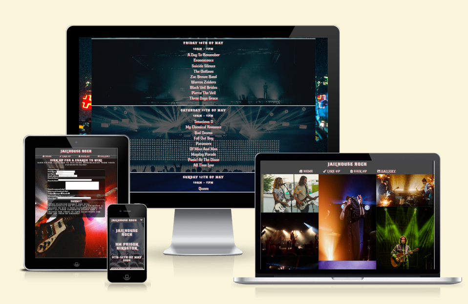

## Features of the site.

## Main styles on all pages

The the font I chose was a rock and roll style font to stick with the theme that this is a site to advertise a rock concert as a majority of the pages are a darker color, I made the text white with a text shadow of red to add contrast from the background colors to the text to make the text stand out a lot more.

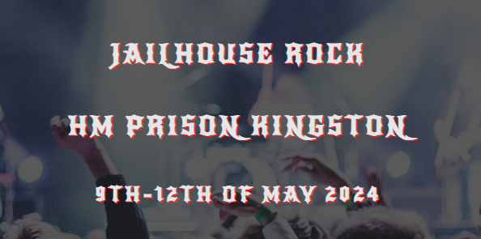

The wallpaper I chose to put behind the main page, which is only visible when the screen is a certain width or more, fits with the theme of the whole website. The reason I chose to do this and only let the main content of the page be a certain width is to force the content in the middle of a screen to help the viewers focus on the page.

## Navigation links and header

The navigation links are positioned on top of the page to help you navigate your way through the site. There are four pages within the site that you can go to by clicking the links. All links are interactive and respond to hovering when the site is viewed on a desktop, when the links are hovered over an underline shows up under the text.

*The mobile version has a hidden navigation link to make the website less cluttered. The nav bar is only visible when tapping on the down arrow.* 

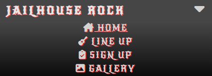

## Footer

The footer has a button link to Facebook, Instagram, Twitter (X), and Youtube. Each link loads up the correct social network in a new tab so you never have the leave the main page.

## Hero image and overlay text.

The hero image I used is of a band on stage and the photo was taken within the crowd to show you that this site is made to advertise a music festival. the overlay text tells you the name of the festival as well as a location, date and also houses a button link that takes you to Google Maps and the location of the festival. 

*The button itself has a hover feature that changes the appearance of the button.*

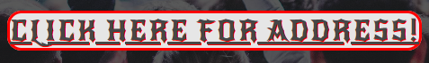

## Why choose Jailhouse Rock?

This section was added to tell the targeted audience why they should come to the Jailhouse Rock Festival and all the things it has to offer. The text style changes from the header to the paragraph as the smaller text becomes harder to read with the red text-shadow.

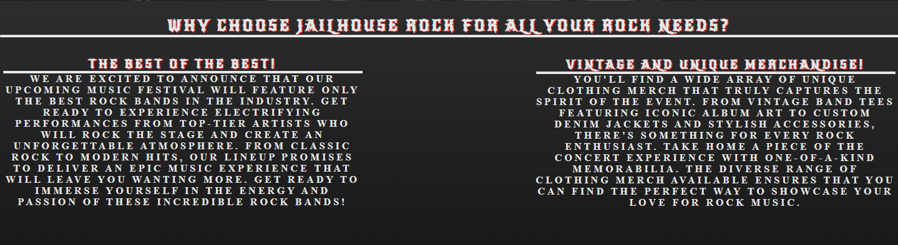

## Three link buttons.

On the bottom of the home page above the footer, I have added 3 link buttons that also take you to the other 3 pages but give a brief description of what each page has to offer.

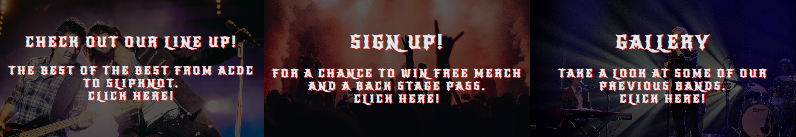

## The lineup page

The lineup page has been laid out in a collum to help the reader focus on the names of the bands instead of having to look from one side of the screen to the other, reading the bands off like a book. I have also implemented the background images all of a similar color to add contrast from the images to the text thus making the text more overpowering than the background images. each section tells you the date the time and what bands will be performing on that specific day.

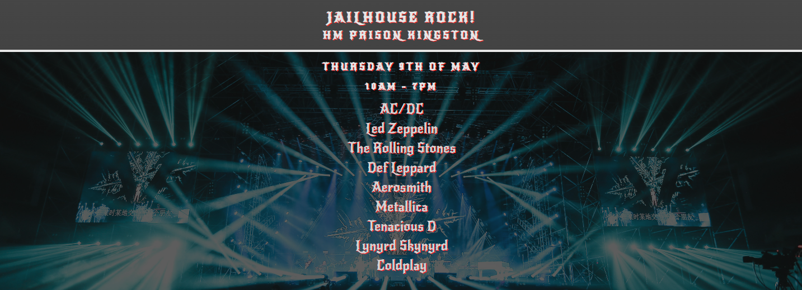

## The signup page

I have added a large image for the background that sticks with the themes of the site. The form itself is placed in the center of the page and contains a first and last name field and an email field all of which are required to be filled, the form also includes 2 text boxes of different sizes a checkbox section, and finally a submit button. underneath the form is a paragraph element that explains what you will receive by submitting this form.

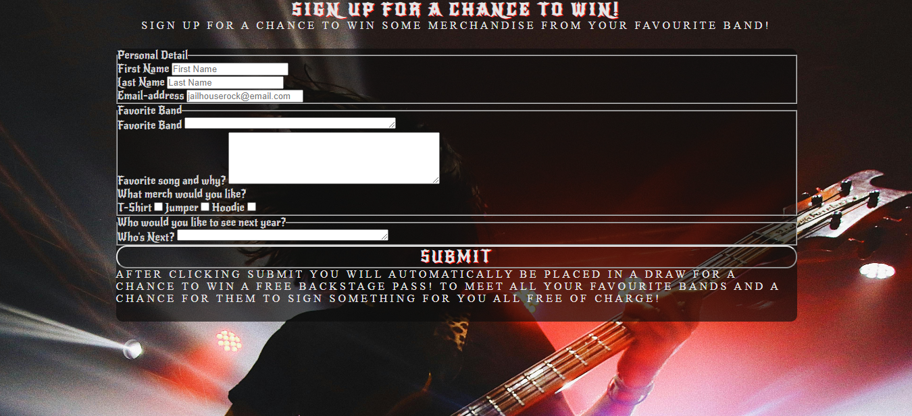

## The Gallery Page

The gallery page houses all sorts of images linked in with rock concerts the page itself is interactive with different devices. each photo has an alt text to explain what the image is of.

*Laptops and PC's have the images displayed in 3 collumns.*

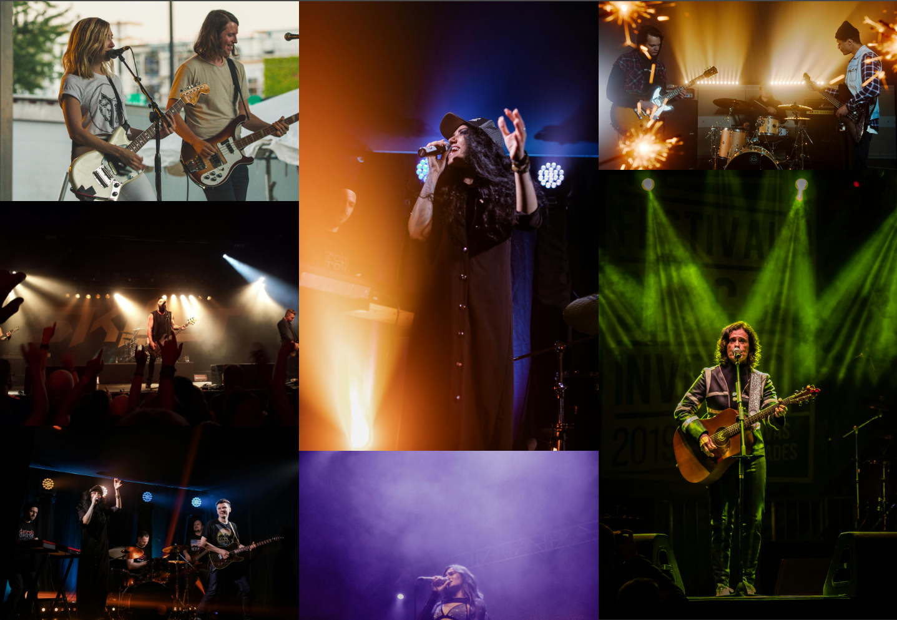

*Tablets have the images displayed in 2 collumns side by side.*

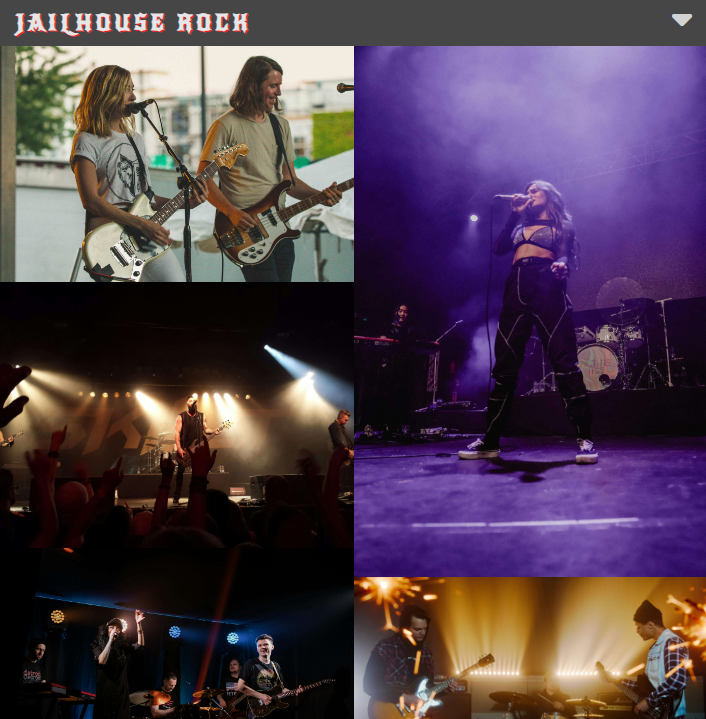

*Mobile devices have the images displayed in a single collum.*

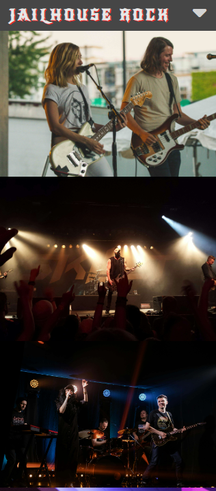

## All tests performed

when testing the functionality of the website I tests all nav links even the header link to test if they all work as well as testing the 3 button links on the bottom of the index page. I have tested all social media links and made sure they all take you to the correct social media page. I have tested the address button to make sure it takes you to a specific position on Google Maps. I tested all the required elements in the form section and tested if the form was sent to the correct page.  I tested how the site works on different devices as well as testing it on my own devices such as my phone my tablet my laptop and my PC with an ultrawide monitor.

I ran all the HTML codes through the [HTML Validator](https://validator.w3.org/)

I also ran all the css code through the [CSS Validator](https://jigsaw.w3.org/css-validator/)

I also ran each page through the lighthouse feature on the Chrome dev tools.

## Fixes

during the final tests of the site a few issues came up:

Firstly the response time for the gallery was 14 seconds to load everything up. I found that the issue was that the images I was using was in 4k resolution. To fix the issue I compressed the images using the a website called image compressor (linked in credits). After compressing the images the response time went down to 3.5 seconds increasing the performance rating.

Another issue came up where if you held your phone in landscape mode on the signup page the form itself would appear below the footer, extending the screen down but with no styles behind it. To fix the issue I forced the main content to be larger in height than the form itself which fixed the issue.

Finaly just before depolying this site I realised that I forgot to link the gallery.html to the 3rd button on the bottom of the index page stopping that button from working as it should. I fixed this issue by correcting the file path.

# Credits

## Content:

+ The text style code idea was found using [mdn web docs](https://developer.mozilla.org/en-US/docs/Web/CSS)

+ The drop down nav menu code and gallery collum idea came from my first walkthrough project [Love Running](https://jonowenwilliams.github.io/Project1Loverunning/)

+ The icons i used came from [Font Awesome](https://fontawesome.com/)

+ The fonts i used on the site (New Rocker, RocknRoll) came from [Google Fonts](https://fonts.google.com/)

## Media:

+ All images used on this site were stock photos from [Pexels](https://www.pexels.com/)
